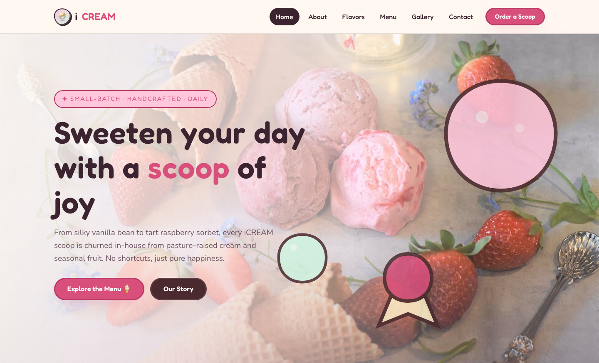

# iCREAM — Artisanal Ice Cream & Dessert Shop

**A premium, playful scoop-shop website: small-batch ice cream, handcrafted sundaes and handmade waffle cones — built with pure HTML5, CSS3 and vanilla JavaScript.**

---

## One-line Pitch

iCREAM is a candy-bright, premium ice cream shop website with a creamy pastel palette, hand-drawn-feel rounded typography, an animated hero that crossfades through signature sundaes, and a full menu with live category filters — all served from a single token-driven stylesheet with zero frameworks.

---

## 📸 Screenshot

## Design System

| Token | Value | Used for |
| --- | --- | --- |
| `--cream` | `#fff8f0` | Page background (warm vanilla cream) |
| `--milk` | `#fff1f5` | Alternating section background (strawberry milk) |
| `--surface` | `#ffffff` | Cards & panels |
| `--ink` | `#3b2430` | Primary text (dark cocoa) |
| `--ink-soft` | `#6b5160` | Secondary text |
| `--muted` | `#967d89` | Muted text |
| `--straw` | `#ffc7dc` | Soft strawberry pastel |
| `--straw-deep` | `#ff9ec0` | Strawberry mid-tone |
| `--mint` | `#cff3e0` | Soft mint pastel |
| `--vanilla` | `#ffefc9` | Soft vanilla pastel |
| `--grape` | `#e7d9f7` | Soft grape pastel |
| `--raspberry` | `#d94f7c` | Bold accent — raspberry |
| `--raspberry-deep` | `#b93a65` | Accent hover |
| `--choco` | `#4a2a2e` | Dark accent & footer |
| `--font-display` | `"Fredoka", Nunito, system-ui` | Headings — rounded, friendly |
| `--font-body` | `"Nunito", system-ui, sans-serif` | Body copy — clean sans |
| `--fs-hero` | `clamp(2.6rem, 6vw, 4.6rem)` | Hero display |
| `--radius-lg` | `2.5rem` | Cards & panels |
| `--radius-pill` | `999px` | Buttons, eyebrows, filters |
| `--shadow-candy` | `0 14px 34px -14px rgba(217,79,124,.35)` | Raspberry glow shadow |
| `--shadow-lift` | `0 26px 60px -22px rgba(59,36,48,.3)` | Card hover depth |
| `--ease` | `cubic-bezier(.22,1,.36,1)` | Motion signature |

### Signature motifs

- **Organic scoop shapes** — every thumbnail, avatar and icon sits in a blob (asymmetric border-radius) with a thick ink outline and a hard offset shadow, like stickers on a cone.
- **Candy borders** — 2.5–4px ink outlines on cards and images for a hand-drawn feel.
- **Ribbon dividers** — sweeping SVG wave strips separate sections, alternating cream and chocolate bands.
- **Squiggle underlines** — display headings get a hand-drawn stroke via inline SVG.

---

## Pages

| Page | Purpose | Link |
| --- | --- | --- |
| Home | Hero carousel crossfade, craft pillars, story preview, menu preview, promo banner, gallery strip, testimonials, stats, Scoop Club newsletter | [index.html](index.html) |
| About | Story split, stats, philosophy, team grid, visit CTA | [about.html](about.html) |
| Our Flavors | Craft process, signature scoops, events & catering, testimonials | [service.html](service.html) |
| Menu | Full menu with category filter (Ice Cream / Gelato / Sorbet / Sundaes / Drinks), custom cake orders | [product.html](product.html) |
| Gallery | Portfolio grid, celebration showcase, Instagram CTA | [gallery.html](gallery.html) |
| Contact | Info cards, contact form with validation, embedded map | [contact.html](contact.html) |

All pages share the same sticky navigation (with mobile burger), footer, back-to-top button, scroll-reveal animation and design system.

---

## Tech Stack

- **Markup:** Semantic HTML5 (header, nav, main, section, article, figure, footer)
- **Styling:** CSS3 custom properties, CSS Grid, Flexbox, `clamp()` fluid type, `aspect-ratio`, responsive breakpoints at ~980px (tablet) and ~720px (mobile)
- **JavaScript:** Vanilla JS (IntersectionObserver reveals, burger menu, hero crossfade, menu filter, form validation, smooth anchors, auto-year) — `assets/js/main.js`
- **Fonts:** Google Fonts — [Fredoka](https://fonts.google.com/specimen/Fredoka) (display) + [Nunito](https://fonts.google.com/specimen/Nunito) (body)
- **Icons:** Inline SVG blobs + emoji; emoji favicon via inline `data:image/svg+xml`
- **No frameworks, no build step, no CDN dependencies** beyond Google Fonts

---

## Images

All imagery is original and lives in `assets/img/` — never placeholders.

| File | Use |
| --- | --- |
| `carousel-1.jpg`, `carousel-2.jpg` | Home hero crossfade backgrounds |
| `header.jpg` | Shared page hero banner on inner pages |
| `about.jpg` | Story / parlour photography |
| `product-1..5.jpg` | Menu scoops |
| `service-1..4.jpg` | Craft pillar scoops & extra menu items |
| `portfolio-1..6.jpg` | Gallery grid |
| `promotion.jpg` | Sunday Sundae promo banner + custom cakes |
| `team-1..4.jpg` | Team grid |
| `testimonial-1..3.jpg` | Testimonial avatars |
| `ice-cream-shop-website-template.jpg` | Gallery "menu board" card |

---

## SEO Keywords

ice cream shop website, artisanal ice cream template, gelato menu, ice cream parlor HTML template, dessert shop template, ice cream gallery, sundae bar, premium ice cream website, small-batch ice cream, responsive ice cream shop

---

## License

Free to use for personal and commercial projects. Images are included assets for demonstration; swap in your own photography for production.

---

### Let's Build Something Together 🚀

[https://tally.so/r/q4q1L9](https://tally.so/r/q4q1L9)
